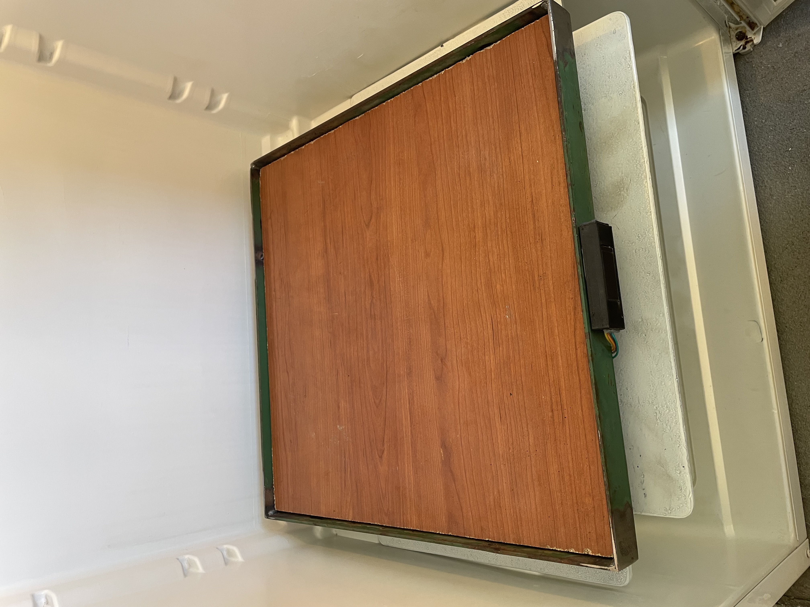
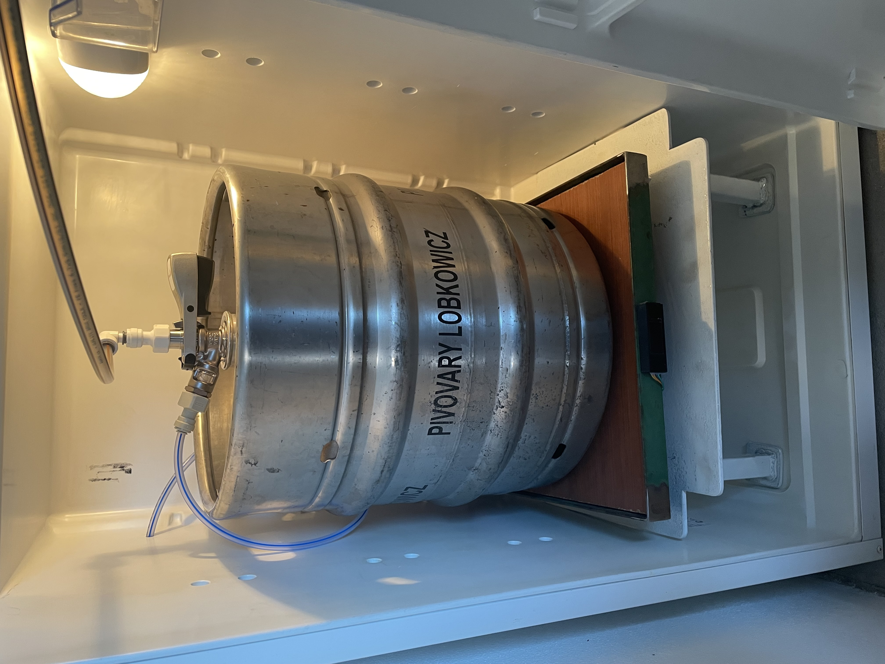
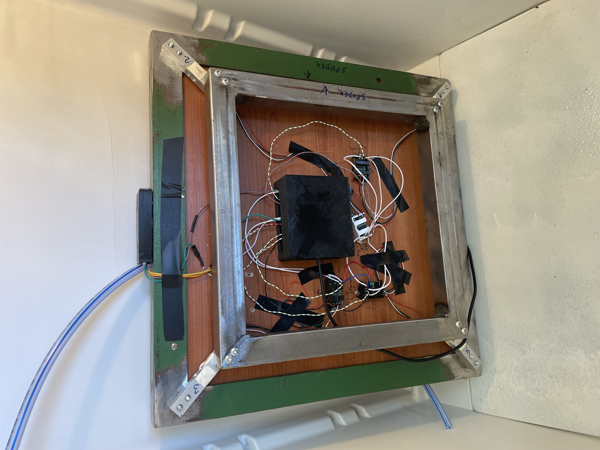
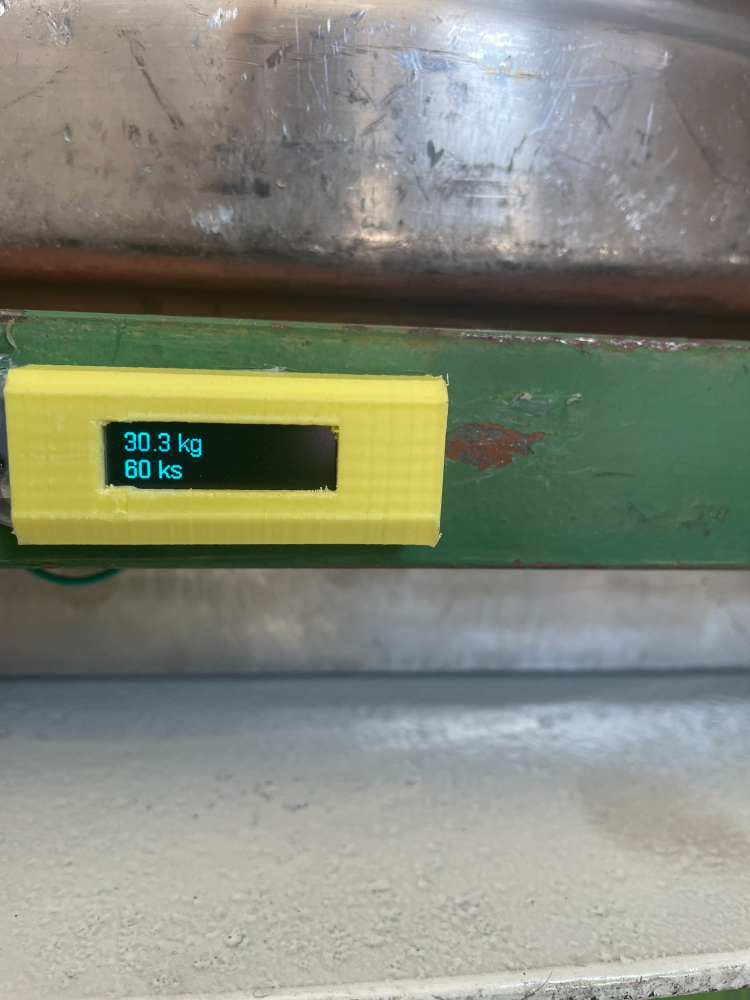
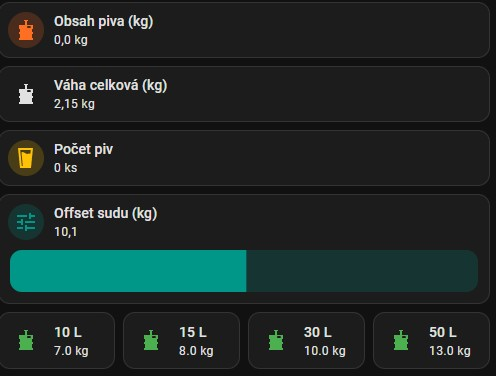

<div align="center">

# 🍺 Pivní Váha – Chytrý monitor obsahu sudu

### Inteligentní váha pro sledování obsahu pivního sudu v reálném čase

[](LICENSE)
[](https://esphome.io/)
[](https://www.home-assistant.io/)
[](https://www.espressif.com/en/products/socs/esp32)

[🇬🇧 English Documentation](README.md)

</div>

---

## 📸 Fotky

<div align="center">

| Platforma váhy | Sud v lednici | Elektronika (spodek) |
|:-:|:-:|:-:|
|  |  |  |

| OLED displej – váha + počet piv |
|:-:|
|  |


</div>

---

## 📋 Přehled

Chytrá váha pro **automatické sledování množství piva v sudu** s integrací do **Home Assistant**. Systém používá čtyři tenzometry pro přesné měření, OLED displej pro lokální zobrazení a pokročilou kalibraci s trvalým uložením do flash paměti.

### ✨ Klíčové vlastnosti

- **🎯 Přesné měření** – 4× tenzometry s HX711 převodníky, mediánový + EMA filtr
- **📺 OLED displej** (SSD1306 128×32) – zobrazuje obsah piva, počet piv a teplotu
- **🔧 Snadná dvoukroková kalibrace** – přežije restart
- **🏠 Home Assistant** – plná integrace přes ESPHome API
- **📱 Webové rozhraní** – přístup přes prohlížeč na portu 80
- **🔌 Offline režim** – funguje i bez Wi-Fi / HA
- **💾 Persistentní paměť** – kalibrace a offset přežijí vypnutí
- **🍺 Automatický přepočet piv** – 1 pivo = 0,505 kg (půllitr)

---

## 🚀 Rychlý start

1. **Připravte hardware** → viz tabulka [Zapojení](#-zapojení)
2. **Stáhněte** `pivni-vaha.yaml`
3. **Nakonfigurujte** Wi-Fi přihlašovací údaje v YAML souboru
4. **Nahrajte** do ESP32 přes ESPHome
5. **Kalibrujte** → viz průvodce [Kalibrace](#️-kalibrace)
6. **Nastavte offset** prázdného sudu
7. **Hotovo!** 🎉

---

## 📦 Hardware (BOM)

| Komponenta | Specifikace | Množství | Poznámka |
|------------|-------------|----------|----------|
| ESP32 DevKit v1 | 38-pin | 1× | [AliExpress](https://www.aliexpress.com/item/1005005626482837.html) |
| HX711 | 24-bit ADC zesilovač | 4× | |
| Tenzometr (load cell) | 20 kg bar type | 4× | Doporučeno 20 kg |
| OLED displej | SSD1306 128×32 I²C | 1× | 0,96" |
| DS18B20 | Teplotní senzor, 1-Wire | 1× | + pull-up rezistor 4,7 kΩ |
| Propojovací kabely | Dupont M-F, M-M | 1 sada | Doporučeno stíněné |
| Napájecí zdroj | 5V → 3,3V regulovaný | 1× | Kvalitní stabilizovaný |

**Volitelné:**
- 🔌 Stíněné kabely k tenzometrům (lepší stabilita signálu)
- 🏗️ 3D tištěné díly → [3D Tisk](#️-3d-tisk)
- 🔋 Záložní napájení / UPS

---

## 🔌 Zapojení

### Pinout (ESP32 DevKit v1 – 38-pin)

| Modul | Signál | ESP32 Pin |
|-------|--------|-----------|
| **OLED SSD1306** | SDA | **GPIO25** |
| | SCL | **GPIO27** |
| | VCC | 3,3V |
| | GND | GND |
| **DS18B20** | DATA | **GPIO12** |
| | VCC | 3,3V |
| | GND | GND |
| **HX711 – Noha 1** | DOUT | **GPIO34** |
| | SCK/CLK | **GPIO26** *(sdílené pro všechny HX711)* |
| **HX711 – Noha 2** | DOUT | **GPIO35** |
| | SCK/CLK | **GPIO26** |
| **HX711 – Noha 3** | DOUT | **GPIO13** |
| | SCK/CLK | **GPIO26** |
| **HX711 – Noha 4** | DOUT | **GPIO14** |
| | SCK/CLK | **GPIO26** |

> **⚠️ Poznámka:** Všechny HX711 sdílejí **jeden CLK pin (GPIO26)**.
> Napájejte HX711 z **3,3V** kvůli logické kompatibilitě s ESP32.

---

## 🛠️ Instalace

### Krok 1 – Nastavení ESPHome

1. Naklonujte nebo stáhněte tento repozitář
2. V ESPHome (samostatný nebo v Home Assistant) vytvořte nové zařízení
3. Vložte obsah souboru `pivni-vaha.yaml`

### Krok 2 – Konfigurace Wi-Fi

```yaml
wifi:
  ssid: "VaseSSID"
  password: "VaseHeslo"
```

Pro **čistě offline** provoz odstraňte celý blok `wifi:`.

### Krok 3 – Nahrání firmware

1. Připojte ESP32 přes USB
2. Zkompilujte a flashněte
3. Další aktualizace lze provádět přes **OTA** (Over-The-Air)

---

## ⚙️ Kalibrace

### Krok 1 – Kalibrace A: Uložení nuly

1. **Odstraňte veškerou zátěž** z váhy
2. Stiskněte **„Calibration A – Store Zero"** v Home Assistant
3. RAW nulové hodnoty (`zero1..4`) se uloží do flash

### Krok 2 – Kalibrace B: Výpočet scale

1. Umístěte **přesně 2,0 kg závaží** doprostřed váhy
2. Stiskněte **„Calibration B – Calculate Scale (2.0 kg)"**
3. Koeficienty (`scale1..4`) se vypočítají automaticky (zvládne i obrácenou polaritu)

### Krok 3 – Ověření

- Entita **„Raw Weight"** by měla zobrazovat cca **2,00 kg** (±0,05 kg)
- Pokud ne, opakujte kalibraci

### Krok 4 – Nastavení offsetu sudu

Použijte posuvník **„Keg Offset (kg)"** v Home Assistant:

| Typ sudu | Hmotnost prázdného sudu |
|----------|------------------------|
| 10 L | 7,0 kg |
| 15 L | 8,0 kg |
| 30 L | 10,0 kg |
| 50 L | 13,0 kg |

> **💡 Tip:** Pro nejpřesnější offset zvažte prázdný sud na kuchyňské váze.

### Krok 5 – Hotovo!

OLED displej zobrazuje:
- **Beer Content** – hmotnost obsahu v kg
- **Beer Count** – počet zbývajících půllitrů

---

## 🏠 Entity v Home Assistant

**Senzory:**
| Entity ID | Popis |
|-----------|-------|
| `sensor.pivni_vaha_beer_content` | Obsah piva (kg) |
| `sensor.pivni_vaha_raw_weight` | Celková hrubá váha (kg) |
| `sensor.pivni_vaha_beer_count` | Počet zbývajících piv (ks) |
| `sensor.pivni_vaha_leg_1` … `leg_4` | Váha na jednotlivých nohách (kg) |

**Ovládací prvky:**
| Entity ID | Popis |
|-----------|-------|
| `number.pivni_vaha_keg_offset_kg` | Offset prázdného sudu |
| `button.pivni_vaha_calibration_a_store_zero` | Kalibrace A |
| `button.pivni_vaha_calibration_b_calculate_scale_2_0_kg` | Kalibrace B |

### Dashboard

Importujte `HA-Dashboard.yaml` do Home Assistant pro předpřipravenou kartu s:
- Zobrazením obsahu a počtu piv
- Posuvníkem offsetu sudu
- Rychlými tlačítky pro 10 / 15 / 30 / 50 L sudy




---

## 🖨️ 3D Tisk

| Model | Popis | Odkaz |
|-------|-------|-------|
| Pouzdro ESP32 | Jednoduché pouzdro pro ESP32 DevKit | [Printables](https://www.printables.com/model/1014797-simple-case-for-the-cheap-esp32-breakout-board-of/files) |
| Držák HX711 | Držák pro modul HX711 | [Printables](https://www.printables.com/model/879042-hx711-ad-module-board-bracket) |
| Pouzdro OLED SSD1306 | Pouzdro pro displej SSD1306 128×32 | [Thingiverse](https://www.thingiverse.com/thing:2844143/files) |

**Nastavení tisku:** PLA nebo PETG · výplň 20–30% · podpory dle potřeby

---

## 🔌 Offline režim

Firmware běží **plně offline** bez Wi-Fi nebo Home Assistant:

- Měření a výpočty probíhají lokálně na ESP32
- OLED zobrazuje data v reálném čase
- Kalibrace uložena ve flash paměti ESP32
- `wifi.reboot_timeout: 0s` zabraňuje restartu při ztrátě Wi-Fi
- Pro minimální offline build odstraňte bloky `wifi:`, `api:`, `ota:`, `web_server:`

---

## ❓ FAQ / Řešení problémů

**`HX711 is not ready for new measurements yet!`**
→ Zachovejte `update_interval: 1s` a sdílený CLK na GPIO26. Zkontrolujte napájení všech HX711.

**Nesmyslné hodnoty po startu**
→ Proveďte Kalibraci A (prázdná váha) a pak Kalibraci B (2 kg závaží). Zkontrolujte zapojení tenzometrů.

**Nestabilní měření**
→ Použijte kvalitní 3,3V zdroj (ne přímo USB). Použijte stíněné kabely k tenzometrům. Mechanicky zpevněte vše. Snižte alpha EMA filtru v YAML (např. 0,1 místo 0,2).

**OLED mimo střed**
→ Upravte `const int X` v OLED lambdě (např. `const int X = 20;`) nebo `offset_x:`.

**Funguje displej v lednici?**
→ Ano – displej SSD1306 128×32 byl testován a funguje správně v chladném prostředí (lednice). Hmotnost, počet piv i teplota se zobrazují spolehlivě.

**Nesprávný počet piv**
→ Zkontrolujte `MASS_PER_BEER = 0.505` kg. Upravte v YAML pro různé velikosti sklenic.

---

## 🤝 Přispívání

Příspěvky jsou vítány! Viz [CONTRIBUTING.md](CONTRIBUTING.md).

- 🐛 [Nahlásit chybu](https://github.com/Samot89/Beer-Keg-Scale/issues/new?template=bug_report.md)
- ✨ [Navrhnout funkci](https://github.com/Samot89/Beer-Keg-Scale/issues/new?template=feature_request.md)

---

## 📄 Licence

**Nekomerční licence** – volné použití pro osobní a hobby účely. Komerční použití je zakázáno. Viz [LICENSE](LICENSE) pro úplné podmínky.

---

<div align="center">

**Vyrobeno s 🍺 a ❤️ pro pivní nadšence**

Pokud se vám projekt líbí, dejte mu ⭐ na GitHubu!

</div>
